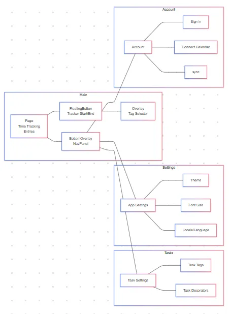
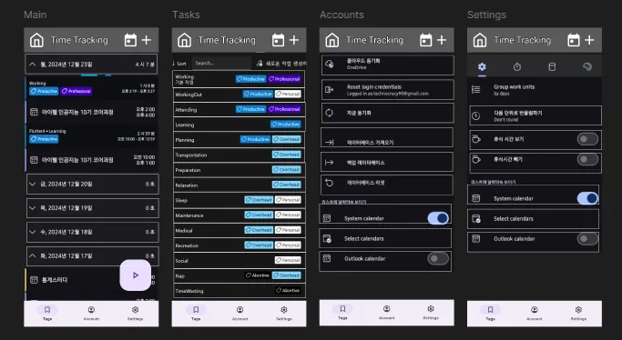

# WorkingHours 앱 분석 및 역설계 하기        

## 앱 정보

- **앱 이름** 

  - GetProductive!

- **시장(마켓)**  

  - 시장은 마켓

- **타겟**  

  - 타겟은 타겟

## 앱 구조도 (사용 툴: Mermeid)

## 앱 와이어프레임 (사용 툴 : Figma)

## 프로토타이핑 (사용 툴 : Figma)
[프로토타입](https://www.figma.com/proto/awbTeTq6e6LmNL9kh82h7C/GetProductive?node-id=1-3&t=R7RaxaKWXVPq3wfd-1&scaling=scale-down&content-scaling=fixed&page-id=0%3A1&starting-point-node-id=1%3A3)

## 페이지 구현
1. SubQuest C 14.dart - 직접 페이지를 빌드하지는 않으며, 다른 페이지를 호출하는 역할을 합니다.
2. pages/tracking.dart - 타임트래킹 작업이 이루어지는 메인페이지입니다.
3. pages/tasks_settings.dart - 타임트래킹을 위한 작업을 설정하는 페이지입니다.
4. pages/app_settings.dart - 앱 자체를 설정하는 페이지입니다.
5. pages/nwe_task.dart - 타임트래킹 기록을 직접 입력하는 페이지입니다.

## 구현영상 
[구현영상](app.mp4)

## 회고
과제의 범위가 명확하지 않아서 동기부여가 잘 안돼요
